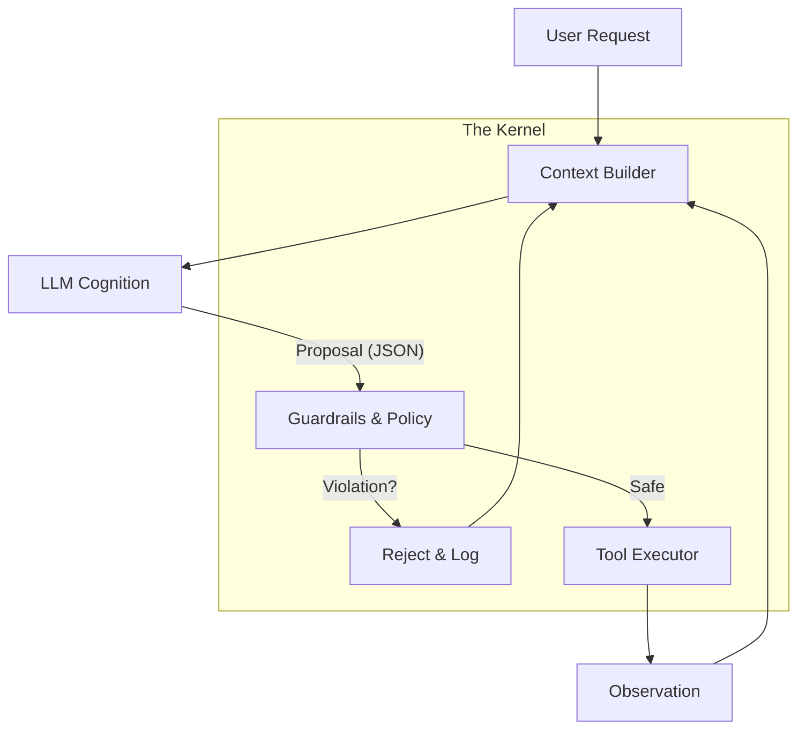

# Kite Architecture: The "Boring" Kernel

> **"LLM outputs are proposals. Code is the law."**

Kite is not an "Agent Framework" in the traditional sense. It is a **reliability kernel** for stochastic text generation. It treats LLMs as untrusted components and wraps them in a rigid, deterministic execution boundary.

## 1. The Core Pattern: Separation of Powers

Most frameworks mix these three layers. Kite separates them strictly:

### Layer 1: Cognition (The Untrusted Brain)
*   **Component**: The LLM (OpenAI, Anthropic, etc.).
*   **Role**: Advisor / Planner.
*   **Authority**: **Zero**.
*   **Output**: Semantic intent (JSON/Text).
*   **Failsafe**: Hallucinations here are expected and contained.

### Layer 2: The Kernel (The Enforcement Layer)
*   **Component**: Kite Framework.
*   **Role**: Judge / Router.
*   **Authority**: **Absolute**.
*   **Responsibility**:
    *   **Parsing**: Converting fuzzy text to strict types.
    *   **Validation**: Checking permissions, budgets, and safety policies.
    *   **Routing**: Deciding *if* an action happens, not just *how*.

### Layer 3: Execution (The Hands)
*   **Component**: Tools / APIs / Database.
*   **Role**: Doer.
*   **Trigger**: Only reachable if Layer 2 permits.

---

## 2. The Data Flow

Every action in Kite follows this deterministic lifecycle:

### Critical Concept: The "Proposal"
The LLM never "calls" a tool. It **proposes** a tool call.
*   **Prompt**: "I want to delete database X."
*   **LLM Proposal**: `{"tool": "delete_db", "args": {"id": "X"}}`
*   **Kernel Check**:
    *   *Is `delete_db` in the allowed tools list?*
    *   *Does the user have `admin` scope?*
    *   *Is "X" a protected production DB?*
*   **Outcome**: If any check fails, the tool is **never touched**. The LLM receives an error message: *"Policy violation: Cannot delete protected DB."*

---

## 3. Reliability Primitives

Kite provides "Infrastructure-grade" primitives, not "Demo-grade" features.

### A. The Circuit Breaker
LLMs get stuck in loops. APIs fail. The Circuit Breaker is active by default.
*   **Mechanism**: Tracks consecutive failures or timeouts per agent/tool.
*   **Action**: "Trips" (opens) the circuit, instantly failing subsequent calls without hitting the provider.
*   **Recovery**: Half-open state allows a single test request after a cooldown.

### B. Shell Whitelisting (The "No-rm-rf" Guarantee)
The `ShellTool` is often the source of catastrophic failure.
*   **Kite Approach**: No free-text shell access.
*   **Mechanism**: The kernel matches commands against a strict regex whitelist *before* execution.
*   **Result**: `ls -la` works. `ls -la; rm -rf /` is rejected at the syntax level.

### C. Deterministic Pipelines
For mission-critical flows, "autonomy" is a bug.
*   **Pattern**: Define a rigid graph of steps.
*   **Agent Role**: The agent only fills in the data *within* a step. It cannot change the steps.
*   **Use Case**: Financial transactions, compliance reports.

---

## 4. Responsibility Matrix

When a bug occurs, who is responsible?

| Failure Mode | Responsible Layer | Fix |
| :--- | :--- | :--- |
| **"The agent misunderstood the user"** | Prompt / Context | Improve system prompt or RAG retrieval. |
| **"The agent tried to do something dangerous"** | **Kite Kernel (YOU)** | **CRITICAL**: Missing policy or guardrail. Fix code. |
| **"The agent did something dangerous"** | **Kite Kernel (YOU)** | **CATASTROPHIC**: Implementation failure. |
| **" The agent crashed the app loop"** | Circuit Breaker | Tune threshold logic. |

---

## 5. Design Manifesto

1.  **Safety > Magic**: We prefer a `PermissionDenied` error over a "creative" solution.
2.  **Explicit > Implicit**: No hidden prompts. No "magic" chains. You see every byte sent to the LLM.
3.  **Production > Demo**: We assume the environment is hostile, the user is malicious, and the LLM is drunk.

**Kite is the designated driver.**
