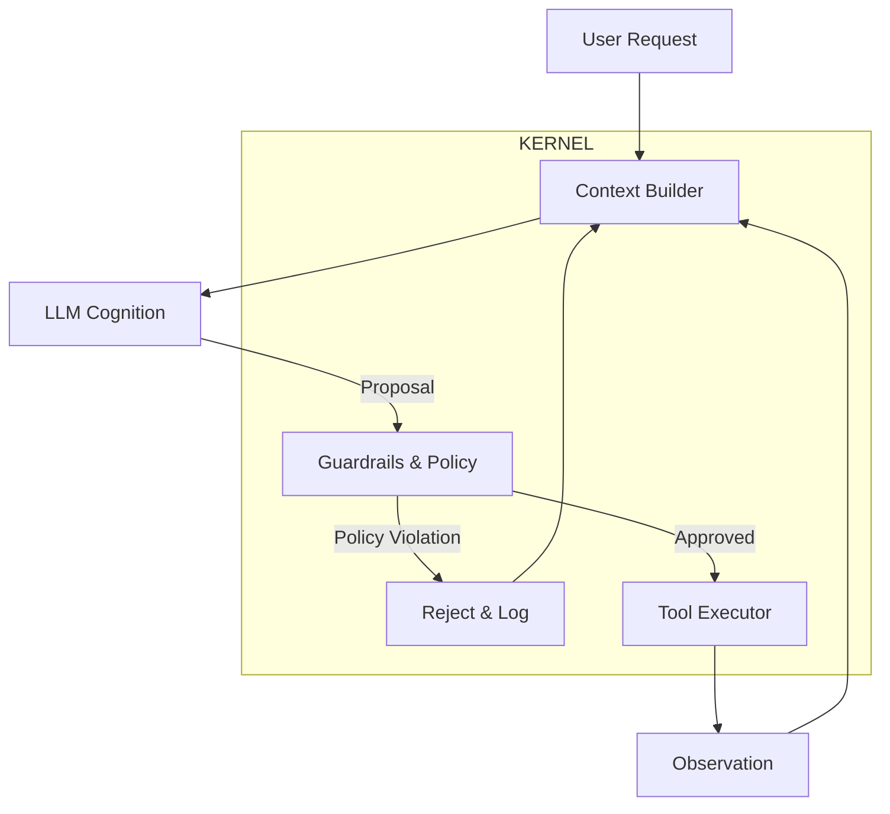

# Kite Architecture: The Reliability Kernel

Kite is a reliability kernel for stochastic text generation systems. It treats LLMs as untrusted components and wraps them in a deterministic execution boundary.

## 1. Core Pattern: Separation of Powers

Kite separates systems into three distinct layers:

### Layer 1: Cognition (The LLM)
*   **Role**: Planner / Advisor.
*   **Authority**: Zero.
*   **Output**: Semantic intent (JSON/Text).
*   **Failure Model**: Hallucinations are treated as expected exceptions.

### Layer 2: The Kernel (Enforcement)
*   **Role**: Router / Validator.
*   **Authority**: Absolute.
*   **Responsibilities**:
    *   **Parsing**: Converting unstructured text to strict types.
    *   **Validation**: Checking permissions, budgets, and safety policies.
    *   **Routing**: Determining if an action is permitted.

### Layer 3: Execution (Tools)
*   **Role**: Capability Provider.
*   **Trigger**: Only invoked if Layer 2 permits.

---

## 2. Data Flow

Every action follows a deterministic validation lifecycle:

### The Proposal Pattern
The LLM does not execute tools directly. It **proposes** a tool call.

1.  **Proposal**: `{"tool": "delete_db", "args": {"id": "X"}}`
2.  **Kernel Validation**:
    *   Is `delete_db` in the allowed whitelist?
    *   Does the effective user possess `admin` scope?
    *   Is the resource `X` protected?
3.  **Outcome**: If validation fails, the tool is not executed. The system returns a structured error to the agent context.

---

## 3. Reliability Primitives

Kite provides infrastructure-level primitives for fault tolerance.

### A. Circuit Breakers
Prevents cascading failures when models or APIs degrade.
*   **Mechanism**: Tracks failure rates/timeouts per component.
*   **Action**: Opens the circuit after `N` consecutive failures, failing fast without upstream calls.
*   **Recovery**: Half-open state allows controlled retry attempts.

### B. Shell Whitelisting
The `ShellTool` enforces strict command validation.
*   **Mechanism**: Commands are matched against a pre-compiled regex whitelist.
*   **Behavior**: Unknown or non-matching commands are rejected at the syntax level before execution.

### C. Deterministic Pipelines
For high-compliance workflows where autonomy is undesirable.
*   **Pattern**: Pre-defined graph of execution steps.
*   **Agent Role**: Data filling and reasoning within the bounds of the current step.

---

## 4. Responsibility Matrix

| Failure Mode | Responsible Component | Remediation |
| :--- | :--- | :--- |
| **Hallucination / Misunderstanding** | LLM / Prompt Context | Improve prompts or RAG retrieval accuracy. |
| **Attempted Policy Violation** | Kernel (Configuration) | Update guardrails or policy definitions. |
| **Executed Policy Violation** | Kernel (Implementation) | **Critical Bug**: Fix authorization logic. |
| **Resource Exhaustion** | Circuit Breaker | Tune thresholds and timeouts. |

---

## 5. Design Principles

1.  **Safety First**: Prefer `PermissionDenied` errors over unsafe execution.
2.  **Explicit Control**: No hidden prompts or implicit tool chaining.
3.  **Defensive Design**: Assume inputs are hostile and models are unreliable.
